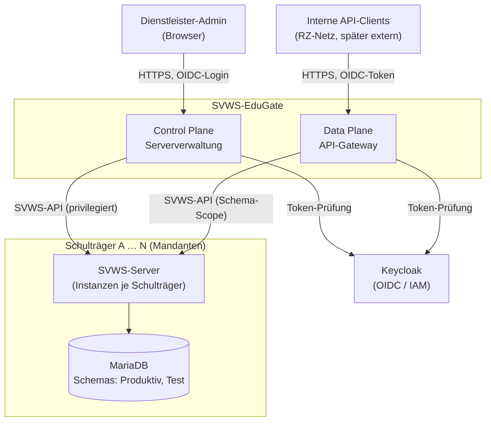
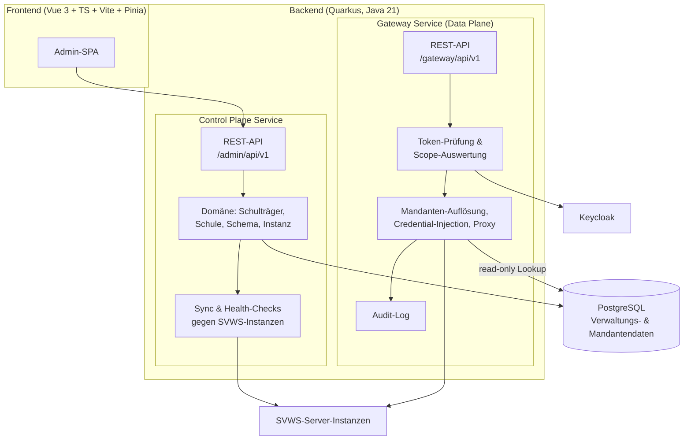
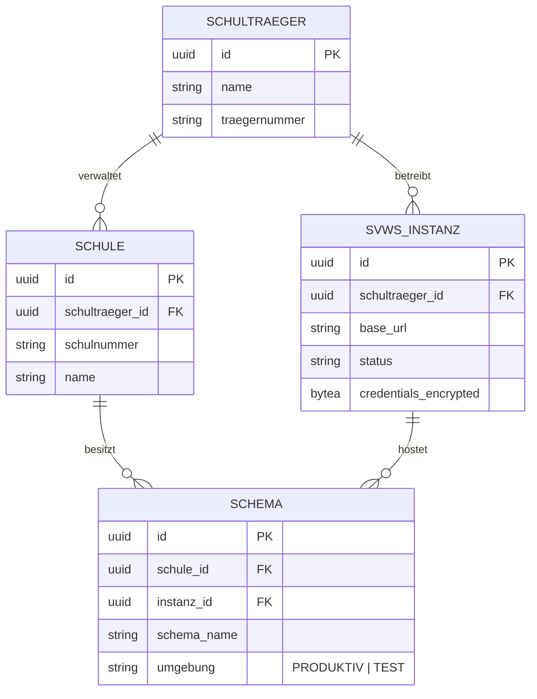
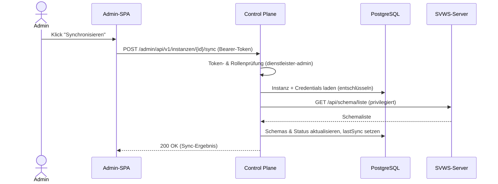
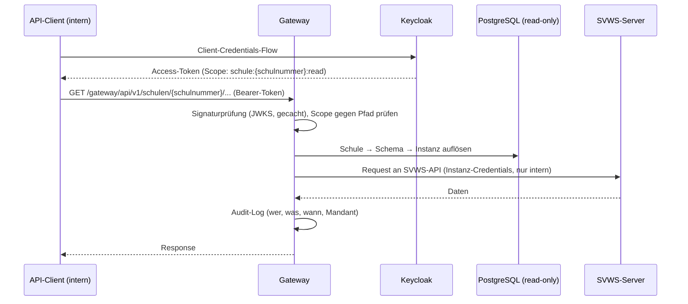
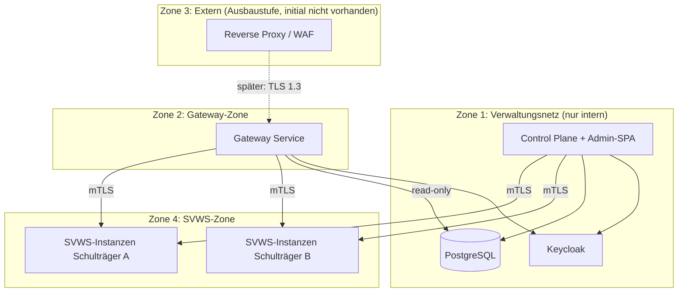

# SVWS-EduGate – Architekturdokumentation

> Struktur nach [arc42](https://arc42.org/), Diagramme in [Mermaid](https://mermaid.js.org/) (wird von GitHub nativ gerendert).
> Architekturentscheidungen sind als ADRs im Ordner [`adr/`](./adr/README.md) dokumentiert.

---

## 1. Einführung und Ziele

SVWS-EduGate ist ein Werkzeug für **Dienstleister**, die SVWS-Server für mehrere **Schulträger** in einem BSI-zertifizierten Rechenzentrum betreiben. Ein Schulträger umfasst mehrere Schulen (bis zu mehreren hundert), jede Schule besitzt ein oder mehrere Schemas in der MariaDB des zugehörigen SVWS-Servers (z. B. Produktiv und Test).

### Produktziele (priorisiert)

| # | Ziel | Beschreibung |
|---|------|--------------|
| 1 | **Serververwaltung** | Komfortable Verwaltung von Schulträgern, deren Schulen, SVWS-Instanzen und Schemas durch den Dienstleister. |
| 2 | **API-Gateway** | Gesicherter, mandantengetrennter Zugriff auf Schuldaten über die SVWS-Server-API. Zunächst nur im internen RZ-Netz, später kontrollierte externe Exponierung. |

### Qualitätsziele

| Priorität | Qualitätsziel | Motivation |
|-----------|---------------|------------|
| 1 | Sicherheit | Schülerdaten (besonders schützenswert, DSGVO), Betrieb im BSI-zertifizierten RZ. |
| 2 | Mandantentrennung | Ein Fehler darf niemals Daten eines fremden Schulträgers offenlegen. |
| 3 | Nachvollziehbarkeit | Jeder Datenzugriff über das Gateway ist auditierbar. |
| 4 | Wartbarkeit / Erweiterbarkeit | Kleines Team, Open Source, langfristige Pflege. |
| 5 | Skalierbarkeit | Mehrere hundert Schulen pro Schulträger, mehrere Schulträger pro Dienstleister. |

### Stakeholder

| Rolle | Erwartung |
|-------|-----------|
| Dienstleister-Admin | Zentrale, effiziente Verwaltung aller Mandanten und Instanzen. |
| Schulträger-Admin | Sicht auf die eigenen Schulen (spätere Ausbaustufe). |
| API-Clients (intern) | Stabiler, dokumentierter, gesicherter Datenzugriff. |
| RZ-Betrieb / ISB | BSI-konformer Betrieb, Protokollierung, Härtung. |
| SVWS-Projekt (MSB NRW) | Nutzung der offiziellen SVWS-API, keine Direktzugriffe auf die MariaDB. |

---

## 2. Randbedingungen

### Technische Randbedingungen

| Randbedingung | Erläuterung |
|---------------|-------------|
| SVWS-Server-API | Einziger Zugriffsweg auf Schuldaten. Kein direkter Zugriff auf die MariaDB der SVWS-Server durch EduGate. |
| MariaDB-Schemastruktur | Ein Schema je Schule und Umgebung (Produktiv, Test) auf der jeweiligen SVWS-Instanz. |
| Container-Betrieb | Auslieferung als Container-Images; Entwicklung mit Docker Compose. |
| TLS | Konfiguration nach BSI TR-02102-2 (mind. TLS 1.2 mit starken Cipher-Suiten, bevorzugt TLS 1.3). |

### Organisatorische / regulatorische Randbedingungen

| Randbedingung | Erläuterung |
|---------------|-------------|
| BSI IT-Grundschutz | Betrieb im BSI-zertifizierten RZ; relevante Bausteine u. a. NET.1.1 (Netzarchitektur), APP.3.1 (Webanwendungen), OPS.1.1.5 (Protokollierung), SYS.1.6 (Container), CON.8 (Softwareentwicklung). |
| DSGVO | Schülerdaten sind personenbezogene Daten; Art. 32 (TOMs), Auftragsverarbeitung zwischen Schulträger und Dienstleister. |
| Open Source | Veröffentlichung unter freier Lizenz; keine Abhängigkeit von Komponenten mit unklarer Lizenz (siehe [ADR-006](./adr/ADR-006-secret-handling-svws-credentials.md)). |
| Interne Nutzung zuerst | Phase 1 ausschließlich im internen RZ-Netz; externe Exponierung ist eine spätere, bewusst dazuschaltbare Ausbaustufe (siehe [ADR-007](./adr/ADR-007-netzzonenkonzept.md)). |

---

## 3. Kontextabgrenzung

**Fachlicher Kontext:** Der Dienstleister-Admin verwaltet über die Control Plane die Mandantenhierarchie (Schulträger → Schule → Schema) und die zugehörigen SVWS-Instanzen. API-Clients rufen Schuldaten ausschließlich über das Gateway ab – niemals direkt vom SVWS-Server und niemals mit dessen Zugangsdaten.

**Abgrenzung (out of scope, Phase 1):** Selbstverwaltung durch Schulträger, externe API-Clients, Provisionierung neuer SVWS-Instanzen (Deployment-Automatisierung), Schreibzugriffe über das Gateway.

---

## 4. Lösungsstrategie

| Problem | Strategie | ADR |
|---------|-----------|-----|
| Zwei Produktziele mit unterschiedlichen Sicherheits- und Lastprofilen | Strikte Trennung von Control Plane (Verwaltung) und Data Plane (Gateway) als getrennte Services im Monorepo. | [ADR-001](./adr/ADR-001-trennung-control-plane-data-plane.md) |
| Mandantentrennung bei mehreren hundert Schulen | `tenant_id` auf jeder Tabelle plus PostgreSQL Row-Level Security als zweite Verteidigungslinie; Wurzeltabelle `schultraeger` mit Policy auf die eigene `id`. | [ADR-002](./adr/ADR-002-mandantenmodell-postgresql-rls.md), [ADR-008](./adr/ADR-008-rls-wurzeltabelle-schultraeger.md) |
| Mandantenübergreifende Admin-Zugriffe ohne Aushebelung der RLS | Kein `BYPASSRLS`; explizite Operator-Policies je Tabelle, gekapselter `OperatorAccess`-Pfad mit Pflicht-Audit (`audit_admin`). | [ADR-009](./adr/ADR-009-operator-zugriff-und-audit.md) |
| Technologie-Kontinuität und SVWS-Nähe | Quarkus (Java 21) im Backend, Vue 3 + TypeScript + Vite + Pinia im Frontend. | [ADR-003](./adr/ADR-003-quarkus-backend.md) |
| Gateway-Funktionalität ohne Betriebs-Overhead | Eigener schlanker Quarkus-Gateway-Service statt Fertigprodukt; Austauschoption dokumentiert. | [ADR-004](./adr/ADR-004-api-gateway-eigenbau.md) |
| Authentifizierung und Autorisierung | Keycloak (OIDC) selbst gehostet; Rollen- und Scope-Modell entlang der Mandantenhierarchie. | [ADR-005](./adr/ADR-005-keycloak-oidc-rollenmodell.md) |
| SVWS-Zugangsdaten schützen | Credentials verlassen niemals das Backend; verschlüsselte Ablage (AES-256-GCM). | [ADR-006](./adr/ADR-006-secret-handling-svws-credentials.md) |
| Spätere externe Öffnung ohne Umbau | Netzzonenkonzept von Beginn an; externe Zone wird später nur „dazugeschaltet“. | [ADR-007](./adr/ADR-007-netzzonenkonzept.md) |

Übergreifende Prinzipien: API-first gegen die SVWS-API, Security by Design, stateless Services, Clean Architecture (Ports & Adapters) im Backend.

---

## 5. Bausteinsicht

### Ebene 1: Container

Der Gateway-Service liest die Mandanten- und Verbindungsdaten nur lesend (eigener DB-User mit minimalen Rechten). Schreibender Zugriff auf das Mandantenmodell ist ausschließlich der Control Plane vorbehalten.

### Mandantenmodell (logisch)

---

## 6. Laufzeitsicht

### Szenario 1: Admin synchronisiert eine SVWS-Instanz (Control Plane)

### Szenario 2: API-Client ruft Schuldaten ab (Data Plane)

Zentrale Invariante: **Die SVWS-Credentials sind zu keinem Zeitpunkt Teil einer Antwort an einen Client.** Clients kennen ausschließlich ihr eigenes OIDC-Token mit eng begrenztem Scope.

---

## 7. Verteilungssicht

Details zu Zonen, Firewall-Regeln und der Ausbaustufe „extern“: [ADR-007](./adr/ADR-007-netzzonenkonzept.md).

---

## 8. Querschnittliche Konzepte

- **Mandantenfähigkeit:** `tenant_id` (= Schulträger) auf jeder Tabelle; PostgreSQL Row-Level Security mit `FORCE`; Mandantenkontext wird pro Request aus dem Token abgeleitet, nie aus Client-Parametern allein ([ADR-002](./adr/ADR-002-mandantenmodell-postgresql-rls.md), Wurzeltabelle: [ADR-008](./adr/ADR-008-rls-wurzeltabelle-schultraeger.md)). Mandantenübergreifende Admin-Operationen laufen ausschließlich über den auditierten Operator-Pfad ([ADR-009](./adr/ADR-009-operator-zugriff-und-audit.md)).
- **Sicherheit:** OIDC überall; TLS nach BSI TR-02102-2; mTLS in internen Zonen; Security-Header und CSP im Frontend; keine Secrets im Frontend oder in Logs.
- **Protokollierung:** Strukturierte Logs (JSON); getrenntes, unveränderliches Audit-Log für Gateway-Zugriffe (OPS.1.1.5, DSGVO Art. 32); keine personenbezogenen Nutzdaten in Logs.
- **Fehlerbehandlung:** SVWS-Instanzen können nicht erreichbar sein – Statusmodell je Instanz (OK, DEGRADED, UNREACHABLE), Timeouts und Circuit-Breaker im Gateway.
- **Konfiguration:** 12-Factor, Konfiguration über Umgebungsvariablen; `.env.example` im Repo, niemals reale Secrets.

## 9. Architekturentscheidungen

Alle Entscheidungen als ADRs unter [`architecture/adr/`](./adr/README.md).

## 10. Qualitätsanforderungen (Auszug)

| Szenario | Anforderung |
|----------|-------------|
| Ein API-Client mit Scope für Schule X fragt Daten der Schule Y an. | Das Gateway antwortet mit 403; der Vorfall erscheint im Audit-Log. |
| Eine SVWS-Instanz ist nicht erreichbar. | Verwaltung und Gateway bleiben für alle übrigen Mandanten voll funktionsfähig. |
| Ein Schulträger mit 300 Schulen wird geöffnet. | Die Schul-Übersicht lädt in < 2 s (Pagination, serverseitige Filterung). |
| Audit-Nachweis für einen Stichtag wird angefordert. | Alle Gateway-Zugriffe des Tages sind vollständig und manipulationssicher belegbar. |

## 11. Risiken und technische Schulden

| Risiko | Gegenmaßnahme |
|--------|---------------|
| SVWS-API-Änderungen brechen Sync/Gateway. | API-Client-Schicht kapseln, Versionierung beobachten, Contract-Tests. |
| Eigenbau-Gateway erreicht Funktionsgrenzen (Rate-Limiting, Plugins). | Austauschoption Kong/APISIX in [ADR-004](./adr/ADR-004-api-gateway-eigenbau.md) dokumentiert; Gateway-API stabil halten. |
| Schlüsselverlust für Credential-Verschlüsselung. | Key-Rotation-Konzept, dokumentiertes Re-Encrypt-Verfahren ([ADR-006](./adr/ADR-006-secret-handling-svws-credentials.md)). |
| Row-Level Security wird bei neuen Tabellen vergessen. | Migrations-Checkliste + automatisierter Test, der RLS auf allen Tenant-Tabellen prüft. |

## 12. Glossar

| Begriff | Bedeutung |
|---------|-----------|
| Dienstleister | Betreiber von SVWS-Servern für mehrere Schulträger im RZ. |
| Schulträger | Mandant; Kommune o. ä. mit mehreren Schulen. |
| Schema | MariaDB-Datenbankschema einer Schule (Produktiv oder Test) auf einer SVWS-Instanz. |
| SVWS-Instanz | Ein laufender SVWS-Server-Prozess mit zugehöriger MariaDB. |
| Control Plane | EduGate-Teil für Verwaltung (Mandanten, Instanzen, Schemas). |
| Data Plane / Gateway | EduGate-Teil für den Durchgriff von API-Clients auf Schuldaten. |
| ENM | Externes Notenmodul-Datenformat des SVWS-Servers. |
